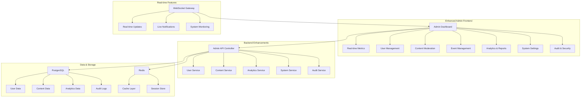

# Admin Interface Enhancement - Design Document

## Overview

The Admin Interface Enhancement builds upon the existing admin dashboard to provide a comprehensive, modern, and efficient administrative interface. The design focuses on improving user experience, adding advanced functionality, and ensuring scalability while maintaining the existing architecture and technology stack.

## Architecture

### Enhanced Admin Interface Architecture



### Technology Enhancements

- **Frontend**: Enhanced React components with improved state management using Zustand
- **Real-time**: WebSocket integration for live updates and notifications
- **Charts**: Advanced data visualization using Recharts and D3.js
- **Export**: Report generation using jsPDF and xlsx libraries
- **File Management**: Enhanced file upload with drag-and-drop using react-dropzone
- **Forms**: Advanced form handling with react-hook-form and zod validation

## Components and Interfaces

### Enhanced Dashboard Components

#### Real-time Dashboard Widget
```typescript
interface DashboardWidget {
  id: string
  title: string
  type: 'metric' | 'chart' | 'list' | 'status'
  size: 'small' | 'medium' | 'large'
  position: { x: number; y: number }
  refreshInterval: number
  data: any
  config: WidgetConfig
}

interface WidgetConfig {
  showTrend?: boolean
  chartType?: 'line' | 'bar' | 'pie' | 'area'
  colorScheme?: string
  filters?: FilterConfig[]
}
```

#### Advanced Data Table Component
```typescript
interface EnhancedDataTableProps<T> {
  columns: TableColumn<T>[]
  data: T[]
  loading?: boolean
  pagination?: PaginationConfig
  sorting?: SortingConfig
  filtering?: FilteringConfig
  bulkActions?: BulkAction<T>[]
  exportOptions?: ExportConfig
  realTimeUpdates?: boolean
}

interface BulkAction<T> {
  id: string
  label: string
  icon: string
  action: (selectedItems: T[]) => Promise<void>
  confirmMessage?: string
  requiresConfirmation?: boolean
}
```

#### Content Moderation Interface
```typescript
interface ModerationQueueItem {
  id: string
  type: 'comment' | 'submission' | 'user_report'
  content: string
  author: User
  target: ContentTarget
  flaggedWords: string[]
  severity: 'low' | 'medium' | 'high'
  createdAt: Date
  status: 'pending' | 'approved' | 'rejected'
}

interface ModerationAction {
  approve: (items: string[], note?: string) => Promise<void>
  reject: (items: string[], reason: string) => Promise<void>
  flag: (items: string[], severity: string) => Promise<void>
}
```

### Backend Service Enhancements

#### Enhanced Admin Service
```typescript
interface AdminService {
  // Dashboard & Metrics
  getDashboardMetrics(): Promise<DashboardMetrics>
  getSystemHealth(): Promise<SystemHealth>
  getRealtimeStats(): Promise<RealtimeStats>
  
  // User Management
  getUsersWithFilters(filters: UserFilters): Promise<PaginatedUsers>
  bulkUpdateUsers(userIds: string[], updates: UserUpdates): Promise<void>
  getUserActivityLog(userId: string): Promise<ActivityLog[]>
  
  // Content Moderation
  getModerationQueue(filters: ModerationFilters): Promise<ModerationQueue>
  bulkModerateContent(actions: ModerationAction[]): Promise<void>
  getSensitiveWordStats(): Promise<SensitiveWordStats>
  
  // Analytics & Reports
  generateReport(config: ReportConfig): Promise<Report>
  getAnalyticsData(query: AnalyticsQuery): Promise<AnalyticsData>
  exportData(format: ExportFormat, query: DataQuery): Promise<Buffer>
}
```

#### Real-time Updates Service
```typescript
interface RealtimeService {
  subscribeToMetrics(callback: (metrics: Metrics) => void): void
  subscribeToUserActivity(callback: (activity: UserActivity) => void): void
  subscribeToSystemAlerts(callback: (alert: SystemAlert) => void): void
  broadcastAdminNotification(notification: AdminNotification): void
}
```

## Data Models

### Enhanced Admin Models

#### Dashboard Configuration
```typescript
interface AdminDashboardConfig {
  id: string
  userId: string
  layout: DashboardLayout
  widgets: DashboardWidget[]
  preferences: AdminPreferences
  createdAt: Date
  updatedAt: Date
}

interface AdminPreferences {
  theme: 'light' | 'dark' | 'auto'
  refreshInterval: number
  defaultFilters: Record<string, any>
  notifications: NotificationSettings
}
```

#### Enhanced Analytics Models
```typescript
interface AnalyticsMetric {
  id: string
  name: string
  value: number
  previousValue?: number
  trend: 'up' | 'down' | 'stable'
  trendPercentage: number
  timestamp: Date
  category: string
}

interface SystemHealth {
  database: ServiceStatus
  redis: ServiceStatus
  email: ServiceStatus
  storage: ServiceStatus
  overallStatus: 'healthy' | 'warning' | 'critical'
  uptime: number
  memoryUsage: MemoryUsage
  cpuUsage: number
}
```

#### Audit Enhancement
```typescript
interface EnhancedAuditLog {
  id: string
  userId?: string
  action: string
  resource: string
  resourceId?: string
  details: AuditDetails
  ipAddress: string
  userAgent: string
  sessionId: string
  timestamp: Date
  severity: 'info' | 'warning' | 'error' | 'critical'
}

interface AuditDetails {
  before?: any
  after?: any
  metadata?: Record<string, any>
  context?: string
}
```

## User Interface Design

### Dashboard Layout Enhancement

#### Responsive Grid System
- **Desktop**: 12-column grid with customizable widget placement
- **Tablet**: 8-column grid with automatic widget resizing
- **Mobile**: Single-column stack with priority-based ordering

#### Navigation Enhancement
- **Sidebar**: Collapsible navigation with icons and labels
- **Breadcrumbs**: Dynamic breadcrumb navigation with context
- **Quick Actions**: Floating action button for common tasks
- **Search**: Global search with autocomplete and filters

### Component Design Patterns

#### Consistent Visual Language
- **Color Scheme**: Primary blue (#3B82F6), Success green (#10B981), Warning amber (#F59E0B), Error red (#EF4444)
- **Typography**: Inter font family with consistent sizing scale
- **Spacing**: 8px base unit with consistent spacing patterns
- **Shadows**: Subtle elevation system for depth perception

#### Interactive Elements
- **Buttons**: Consistent styling with hover and focus states
- **Forms**: Inline validation with clear error messaging
- **Tables**: Sortable headers, row selection, and action menus
- **Modals**: Consistent modal patterns with proper focus management

## Advanced Features

### Real-time Monitoring

#### Live Dashboard Updates
```typescript
interface LiveDashboard {
  metrics: RealtimeMetrics
  alerts: SystemAlert[]
  activities: RecentActivity[]
  notifications: AdminNotification[]
}

interface RealtimeMetrics {
  activeUsers: number
  systemLoad: number
  responseTime: number
  errorRate: number
  updateFrequency: number
}
```

#### WebSocket Integration
- **Connection Management**: Automatic reconnection with exponential backoff
- **Event Handling**: Typed event system for different update types
- **Performance**: Throttled updates to prevent UI flooding
- **Fallback**: Polling fallback for environments without WebSocket support

### Advanced Analytics

#### Custom Report Builder
```typescript
interface ReportBuilder {
  dimensions: ReportDimension[]
  metrics: ReportMetric[]
  filters: ReportFilter[]
  dateRange: DateRange
  groupBy: string[]
  sortBy: SortConfig[]
  format: 'table' | 'chart' | 'summary'
}

interface ReportSchedule {
  id: string
  name: string
  config: ReportBuilder
  schedule: CronExpression
  recipients: string[]
  format: 'pdf' | 'excel' | 'csv'
  isActive: boolean
}
```

#### Data Visualization
- **Interactive Charts**: Drill-down capabilities with contextual filters
- **Comparative Analysis**: Period-over-period comparisons
- **Trend Analysis**: Predictive analytics with trend lines
- **Export Options**: Multiple format support with custom styling

### Bulk Operations System

#### Batch Processing
```typescript
interface BulkOperation {
  id: string
  type: string
  items: string[]
  action: string
  parameters: Record<string, any>
  status: 'pending' | 'processing' | 'completed' | 'failed'
  progress: number
  results: BulkOperationResult[]
  createdAt: Date
  completedAt?: Date
}

interface BulkOperationResult {
  itemId: string
  success: boolean
  error?: string
  data?: any
}
```

## Error Handling & Performance

### Enhanced Error Management

#### Error Boundary System
- **Component-level**: Granular error boundaries for each major section
- **Global Handler**: Centralized error logging and user notification
- **Recovery**: Automatic retry mechanisms for transient failures
- **Reporting**: Detailed error reporting with stack traces and context

#### User-friendly Error Messages
- **Contextual**: Error messages specific to the action being performed
- **Actionable**: Clear instructions on how to resolve issues
- **Progressive**: Escalating detail levels based on user expertise
- **Localized**: Multi-language support for error messages

### Performance Optimization

#### Data Loading Strategies
- **Lazy Loading**: Component-based code splitting
- **Virtual Scrolling**: Efficient rendering of large data sets
- **Caching**: Intelligent caching with invalidation strategies
- **Prefetching**: Predictive data loading based on user behavior

#### Real-time Performance
- **Debouncing**: Input debouncing for search and filters
- **Throttling**: Rate limiting for real-time updates
- **Memory Management**: Proper cleanup of subscriptions and listeners
- **Bundle Optimization**: Tree shaking and dynamic imports

## Security Enhancements

### Access Control
- **Role-based Permissions**: Granular permissions for different admin functions
- **Session Management**: Secure session handling with timeout controls
- **Audit Trail**: Comprehensive logging of all administrative actions
- **IP Restrictions**: Optional IP-based access controls

### Data Protection
- **Input Sanitization**: Comprehensive input validation and sanitization
- **XSS Prevention**: Content Security Policy and output encoding
- **CSRF Protection**: Token-based CSRF protection for all forms
- **Rate Limiting**: API rate limiting to prevent abuse

## Testing Strategy

### Frontend Testing
- **Unit Tests**: Component testing with React Testing Library
- **Integration Tests**: User workflow testing with Cypress
- **Visual Testing**: Screenshot comparison for UI consistency
- **Accessibility**: WCAG compliance testing with axe-core

### Backend Testing
- **API Tests**: Comprehensive endpoint testing with Supertest
- **Performance Tests**: Load testing for admin operations
- **Security Tests**: Penetration testing for admin interfaces
- **Data Integrity**: Database consistency and migration testing

### User Acceptance Testing
- **Admin Workflows**: Complete administrative task testing
- **Performance Benchmarks**: Response time and throughput testing
- **Cross-browser**: Compatibility testing across major browsers
- **Mobile Responsiveness**: Touch interface and responsive design testing