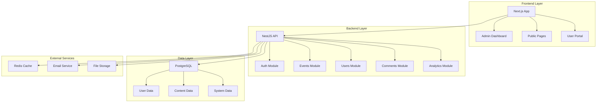

# Conference Management Platform - Design Document

## Overview

The Conference Management Platform is a full-stack web application built with Next.js frontend and NestJS backend, designed to manage academic conferences with comprehensive administrative capabilities. The system supports role-based access control, dual-mode content management (Markdown/HTML), and includes advanced features like sensitive word filtering, analytics, and notification systems.

## Architecture

### High-Level Architecture



### Technology Stack

- **Frontend**: Next.js 14 with TypeScript, TailwindCSS, shadcn/ui components
- **Backend**: NestJS with TypeScript, Prisma ORM
- **Database**: PostgreSQL with Redis for caching and queues
- **Authentication**: JWT with Passport.js
- **File Storage**: Configurable (Local/AWS S3/Aliyun OSS)
- **Email**: Nodemailer with BullMQ for queue management
- **Content Processing**: React Markdown with remark/rehype plugins

## Components and Interfaces

### Frontend Components

#### Core Layout Components
- **AdminLayout**: Main admin dashboard layout with navigation
- **PublicLayout**: Public-facing site layout
- **AuthGuard**: Route protection component for authenticated areas

#### Content Management Components
- **MarkdownEditor**: Rich editor supporting Markdown and HTML with live preview
- **ContentPreview**: Renders markdown/HTML content with syntax highlighting
- **MediaUploader**: File upload component with drag-and-drop support
- **DataTable**: Reusable table component with sorting, filtering, and pagination

#### Dashboard Components
- **MetricsCard**: Display key performance indicators
- **ChartContainer**: Wrapper for data visualization charts using Recharts
- **ActivityFeed**: Real-time system activity display
- **NotificationCenter**: In-app notification management

### Backend Modules

#### Authentication Module (`auth/`)
```typescript
interface AuthService {
  login(credentials: LoginDto): Promise<AuthResponse>
  register(userData: RegisterDto): Promise<User>
  validateToken(token: string): Promise<User>
  refreshToken(refreshToken: string): Promise<AuthResponse>
}

interface RoleGuard {
  canActivate(context: ExecutionContext): boolean
}
```

#### Events Module (`events/`)
```typescript
interface EventsService {
  create(eventData: CreateEventDto): Promise<Event>
  findAll(filters: EventFiltersDto): Promise<PaginatedEvents>
  findOne(id: string): Promise<Event>
  update(id: string, updateData: UpdateEventDto): Promise<Event>
  delete(id: string): Promise<void>
  publish(id: string): Promise<Event>
}
```

#### Content Processing Service
```typescript
interface ContentService {
  processMarkdown(content: string): Promise<ProcessedContent>
  sanitizeHtml(html: string): string
  extractMetadata(content: string): ContentMetadata
}
```

#### Sensitive Words Module (`sensitive-words/`)
```typescript
interface SensitiveWordsService {
  checkContent(content: string): Promise<SensitiveCheckResult>
  addWords(words: string[], level: SensitiveLevel): Promise<void>
  importFromCsv(file: Buffer): Promise<ImportResult>
  exportToCsv(): Promise<Buffer>
}
```

## Data Models

### Core Entities

#### User Entity
```typescript
interface User {
  id: string
  username: string
  email: string
  password: string // hashed
  role: UserRole
  profile: UserProfile
  createdAt: Date
  updatedAt: Date
  isActive: boolean
}

enum UserRole {
  ADMIN = 'admin',
  EDITOR = 'editor',
  MEMBER = 'member'
}
```

#### Event Entity
```typescript
interface Event {
  id: string
  title: string
  description: string
  contentMarkdown: string
  contentHtml: string
  startDate: Date
  endDate: Date
  location: string
  maxAttendees: number
  registrationDeadline: Date
  status: EventStatus
  tags: string[]
  createdBy: string
  createdAt: Date
  updatedAt: Date
}

enum EventStatus {
  DRAFT = 'draft',
  PUBLISHED = 'published',
  CANCELLED = 'cancelled',
  COMPLETED = 'completed'
}
```

#### Registration Entity
```typescript
interface Registration {
  id: string
  userId: string
  eventId: string
  status: RegistrationStatus
  registeredAt: Date
  additionalInfo: Record<string, any>
}
```

#### Comment Entity
```typescript
interface Comment {
  id: string
  userId: string
  targetType: CommentTargetType
  targetId: string
  content: string
  status: CommentStatus
  sensitiveFlags: string[]
  createdAt: Date
  updatedAt: Date
}
```

### Database Schema Design

The system uses PostgreSQL with the following key relationships:
- Users have many Registrations, Comments, and Submissions
- Events have many Registrations and Comments
- Comments are polymorphic (can target Events, News, Submissions)
- Sensitive words are categorized and leveled for flexible filtering

## Error Handling

### Frontend Error Handling
- **Global Error Boundary**: Catches and displays user-friendly error messages
- **API Error Interceptor**: Handles HTTP errors and authentication failures
- **Form Validation**: Real-time validation with clear error messaging
- **Toast Notifications**: Non-intrusive error and success notifications

### Backend Error Handling
- **Global Exception Filter**: Standardizes error responses across all endpoints
- **Validation Pipes**: Automatic DTO validation with detailed error messages
- **Database Error Handling**: Graceful handling of constraint violations and connection issues
- **Rate Limiting**: Prevents abuse with configurable limits per endpoint

### Error Response Format
```typescript
interface ErrorResponse {
  statusCode: number
  message: string | string[]
  error: string
  timestamp: string
  path: string
}
```

## Testing Strategy

### Frontend Testing
- **Unit Tests**: Jest + React Testing Library for component testing
- **Integration Tests**: Testing user workflows and API integration
- **E2E Tests**: Cypress for critical user journeys
- **Visual Regression**: Automated screenshot comparison for UI consistency

### Backend Testing
- **Unit Tests**: Jest for service and utility function testing
- **Integration Tests**: Supertest for API endpoint testing
- **Database Tests**: In-memory PostgreSQL for isolated database testing
- **Security Tests**: Automated security scanning and penetration testing

### Test Coverage Goals
- Minimum 80% code coverage for critical business logic
- 100% coverage for authentication and authorization code
- Comprehensive testing of sensitive word filtering algorithms
- Performance testing for high-load scenarios (1000+ concurrent users)

## Security Considerations

### Authentication & Authorization
- JWT tokens with configurable expiration
- Refresh token rotation for enhanced security
- Role-based access control with granular permissions
- Password hashing using bcrypt with salt rounds

### Input Validation & Sanitization
- DTO validation using class-validator
- HTML sanitization using sanitize-html
- File upload validation (type, size, content scanning)
- SQL injection prevention through Prisma ORM

### API Security
- Rate limiting per IP and user
- CORS configuration for allowed origins
- Helmet.js for security headers
- CSRF protection for state-changing operations

### Content Security
- Sensitive word filtering with configurable severity levels
- Content moderation queue for flagged items
- Audit logging for all administrative actions
- Data encryption for sensitive information

## Performance Optimization

### Frontend Optimization
- Next.js SSR/SSG for improved SEO and initial load times
- Image optimization with Next.js Image component
- Code splitting and lazy loading for large components
- Service worker for offline functionality

### Backend Optimization
- Redis caching for frequently accessed data
- Database query optimization with proper indexing
- Connection pooling for database connections
- Background job processing with BullMQ

### Monitoring & Analytics
- Application performance monitoring (APM)
- Database query performance tracking
- User behavior analytics
- System resource monitoring and alerting