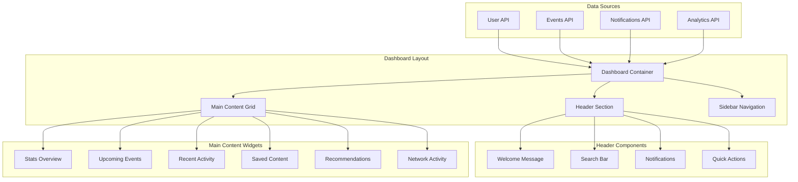

# User Dashboard Enhancement - Design Document

## Overview

The User Dashboard Enhancement transforms the existing basic dashboard into a comprehensive, personalized user experience hub. The design focuses on providing users with actionable insights, quick access to important features, and a clear overview of their platform engagement.

## Architecture

### Component Architecture



### Widget System Design

The dashboard uses a modular widget system where each section is an independent component that can be:
- Reordered by user preference
- Shown/hidden based on user settings
- Refreshed independently
- Customized with different view modes

## Components and Interfaces

### Core Dashboard Components

#### DashboardContainer
```typescript
interface DashboardProps {
  user: User
  initialData: DashboardData
}

interface DashboardData {
  stats: UserStats
  upcomingEvents: Event[]
  recentActivity: Activity[]
  notifications: Notification[]
  savedContent: SavedItem[]
  recommendations: Recommendation[]
  networkActivity: NetworkActivity[]
}
```

#### StatsOverview Widget
```typescript
interface UserStats {
  eventsAttended: number
  upcomingEvents: number
  savedArticles: number
  networkConnections: number
  totalEngagement: number
  monthlyGrowth: {
    events: number
    connections: number
    content: number
  }
}

interface StatsCard {
  title: string
  value: number
  trend: {
    value: number
    isPositive: boolean
    period: string
  }
  icon: string
  color: string
  onClick?: () => void
}
```

#### UpcomingEvents Widget
```typescript
interface EventCard {
  id: string
  title: string
  date: Date
  time: string
  location: string
  status: 'registered' | 'interested' | 'recommended'
  image?: string
  actions: EventAction[]
}

interface EventAction {
  type: 'calendar' | 'ticket' | 'details' | 'share'
  label: string
  handler: () => void
}
```

#### NotificationCenter
```typescript
interface NotificationCenter {
  notifications: Notification[]
  unreadCount: number
  categories: NotificationCategory[]
  onMarkAsRead: (id: string) => void
  onMarkAllAsRead: () => void
  onDismiss: (id: string) => void
}

interface Notification {
  id: string
  type: 'system' | 'event' | 'social' | 'security'
  title: string
  message: string
  timestamp: Date
  read: boolean
  priority: 'low' | 'normal' | 'high'
  actionUrl?: string
  actionText?: string
}
```

#### ActivityFeed Widget
```typescript
interface Activity {
  id: string
  type: 'event_registration' | 'content_save' | 'connection_made' | 'comment_posted'
  title: string
  description: string
  timestamp: Date
  relatedEntity: {
    type: 'event' | 'article' | 'user'
    id: string
    name: string
  }
  icon: string
}
```

#### SavedContent Widget
```typescript
interface SavedItem {
  id: string
  type: 'event' | 'article' | 'news'
  title: string
  description: string
  image?: string
  savedAt: Date
  category: string
  url: string
  tags: string[]
}
```

### Advanced Features

#### Personalization Engine
```typescript
interface PersonalizationService {
  getRecommendations(userId: string): Promise<Recommendation[]>
  updateUserPreferences(userId: string, preferences: UserPreferences): Promise<void>
  trackUserActivity(userId: string, activity: ActivityEvent): Promise<void>
  generateInsights(userId: string): Promise<UserInsights>
}

interface UserPreferences {
  interests: string[]
  eventTypes: string[]
  contentCategories: string[]
  notificationSettings: NotificationSettings
  dashboardLayout: WidgetLayout[]
}
```

#### Real-time Updates
```typescript
interface RealtimeService {
  subscribeToUserUpdates(userId: string, callback: (update: UserUpdate) => void): void
  subscribeToNotifications(userId: string, callback: (notification: Notification) => void): void
  unsubscribe(subscriptionId: string): void
}
```

## Data Models

### Enhanced User Model
```typescript
interface DashboardUser extends User {
  preferences: UserPreferences
  stats: UserStats
  lastLoginAt: Date
  dashboardConfig: DashboardConfig
}

interface DashboardConfig {
  widgetOrder: string[]
  hiddenWidgets: string[]
  refreshInterval: number
  theme: 'light' | 'dark' | 'auto'
}
```

### Analytics Models
```typescript
interface UserAnalytics {
  userId: string
  period: 'daily' | 'weekly' | 'monthly'
  metrics: {
    pageViews: number
    eventRegistrations: number
    contentSaves: number
    networkConnections: number
    timeSpent: number
  }
  trends: {
    engagement: TrendData
    activity: TrendData
    growth: TrendData
  }
}

interface TrendData {
  current: number
  previous: number
  change: number
  changePercent: number
}
```

## User Experience Design

### Layout Structure

#### Desktop Layout (1200px+)
```
┌─────────────────────────────────────────────────────────────┐
│ Header: Welcome | Search | Notifications | Profile         │
├─────────────────────────────────────────────────────────────┤
│ ┌─────────┐ ┌─────────────────────────────────────────────┐ │
│ │         │ │ Stats Overview (4 cards)                    │ │
│ │ Sidebar │ ├─────────────────────────────────────────────┤ │
│ │ Nav     │ │ ┌─────────────────┐ ┌─────────────────────┐ │ │
│ │         │ │ │ Upcoming Events │ │ Recent Activity     │ │ │
│ │         │ │ └─────────────────┘ └─────────────────────┘ │ │
│ │         │ │ ┌─────────────────┐ ┌─────────────────────┐ │ │
│ │         │ │ │ Saved Content   │ │ Recommendations     │ │ │
│ │         │ │ └─────────────────┘ └─────────────────────┘ │ │
│ └─────────┘ └─────────────────────────────────────────────┘ │
└─────────────────────────────────────────────────────────────┘
```

#### Mobile Layout (< 768px)
```
┌─────────────────────────────┐
│ Header: Menu | Search | 🔔  │
├─────────────────────────────┤
│ Welcome Message             │
├─────────────────────────────┤
│ Stats Cards (2x2 grid)      │
├─────────────────────────────┤
│ Upcoming Events (carousel)  │
├─────────────────────────────┤
│ Quick Actions (grid)        │
├─────────────────────────────┤
│ Recent Activity (list)      │
├─────────────────────────────┤
│ Saved Content (carousel)    │
└─────────────────────────────┘
```

### Interaction Patterns

#### Progressive Disclosure
- Summary cards show key information
- Click/tap to expand for detailed view
- Contextual actions appear on hover/focus

#### Smart Defaults
- Most relevant content shown first
- Personalized based on user behavior
- Adaptive layout based on usage patterns

#### Micro-interactions
- Smooth transitions between states
- Loading skeletons for async content
- Success/error feedback for actions
- Real-time updates with subtle animations

## Error Handling

### Graceful Degradation
```typescript
interface WidgetErrorBoundary {
  fallbackComponent: React.ComponentType
  onError: (error: Error, errorInfo: ErrorInfo) => void
  retryHandler: () => void
}
```

### Error States
- **Network Error**: Show cached data with refresh option
- **Authentication Error**: Redirect to login with return URL
- **Permission Error**: Show appropriate access denied message
- **Data Error**: Show empty state with action to reload

### Loading States
- **Initial Load**: Full-page skeleton
- **Widget Refresh**: Individual widget skeletons
- **Infinite Scroll**: Loading indicators at bottom
- **Real-time Updates**: Subtle pulse animations

## Performance Optimization

### Data Loading Strategy
```typescript
interface DashboardDataLoader {
  loadCriticalData(): Promise<CriticalDashboardData>
  loadSecondaryData(): Promise<SecondaryDashboardData>
  prefetchUserContent(): Promise<void>
  refreshWidget(widgetId: string): Promise<WidgetData>
}
```

### Caching Strategy
- **Browser Cache**: Static assets and images
- **Memory Cache**: User session data and preferences
- **Service Worker**: Offline functionality for critical features
- **API Cache**: Server-side caching for frequently accessed data

### Lazy Loading
- Non-critical widgets load after initial render
- Images load on scroll or interaction
- Heavy components code-split and loaded on demand

## Accessibility

### WCAG 2.1 AA Compliance
- Semantic HTML structure for screen readers
- Keyboard navigation for all interactive elements
- High contrast mode support
- Focus management for dynamic content

### Assistive Technology Support
```typescript
interface AccessibilityFeatures {
  screenReaderAnnouncements: boolean
  keyboardShortcuts: KeyboardShortcut[]
  highContrastMode: boolean
  reducedMotion: boolean
}
```

### Internationalization
- RTL language support
- Locale-specific date/time formatting
- Currency and number formatting
- Accessible color schemes for different cultures

## Testing Strategy

### Component Testing
- Unit tests for individual widgets
- Integration tests for widget interactions
- Visual regression tests for UI consistency
- Accessibility testing with automated tools

### User Experience Testing
- A/B testing for layout variations
- Performance testing on various devices
- Usability testing with real users
- Analytics tracking for feature usage

### Performance Testing
- Load testing for concurrent users
- Memory leak detection
- Bundle size optimization
- Core Web Vitals monitoring